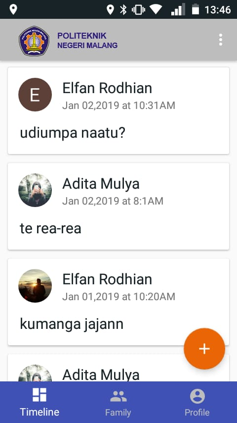

# MyFamilyLocator
Aplikasi Android untuk melihat lokasi anggota keluarga secara real-time.

## Screenshots
    
   
  

## Library dan SDK yang digunakan
- [Firebase Authentication](https://firebase.google.com/)
- [Firebase Realtime Database](https://firebase.google.com/)
- [Firebase UI](https://github.com/firebase/FirebaseUI-Android)
- [Play Services Authentication](https://firebase.google.com/docs/auth/)
- [Play Services Maps](https://developers.google.com/maps/documentation/android-api/)
- [Play Services Location](https://developers.google.com/android/guides/setup)
- [Greenrobot Eventbus](https://github.com/greenrobot/EventBus)
- [EasyPermissions](https://github.com/googlesamples/easypermissions)
- [Picasso](http://square.github.io/picasso/)
- [CircleImageView](https://github.com/hdodenhof/CircleImageView)
- [Material Dialogs](https://github.com/afollestad/material-dialogs)
- [RxJava: Reactive Extensions for the JVM](https://github.com/ReactiveX/RxJava)
- [RxAndroid: Reactive Extensions for Android](https://github.com/ReactiveX/RxAndroid)
- [Clans - FloatingActionButton](https://github.com/Clans/FloatingActionButton)
